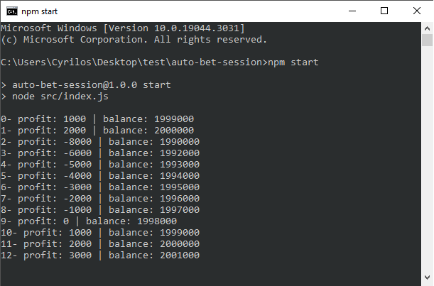

# auto-bet-session
Package providing class for autobetting on gambling platform like (*king.io and *pick.io). There are useful methods for applying easily and programmatically any kind of strategy.

## Installation
Installation using npm
```bash
npm i auto-bet-session
```
## Quick usage example
Applying Martingale bet strategy
```js
const BetSession = require("auto-bet-session");

const PLATFORM = "dogepick.io";
const COOKIES = "<your dogepick cookies>";

async function playDice() {
  var session = new BetSession(PLATFORM, COOKIES);

  /* dogepick strategy */
  session.onWin(() => {
    // reset bet amount to the initial amount
    session.resetBetAmount();
  });

  session.onLoss(() => {
    // 100% bet amount increase
    session.increaseBetAmount(100);
  });

  session.onBet(() => {
    console.log(`${session.count}- profit: ${session.getCurrentProfit()} | balance: ${session.getCurrentBalance()}`);
  });

  /* auto play */
  await session.autoBet(0.00010000, 1.10);
}

playDice();

```

## Fundamental methods for gambling strategy
```js
// increase the current bet amount by the percentage
session.increaseBetAmount(percentage);

// decrease the current bet amount by the percentage
session.decreaseBetAmount(percentage);

// increase the win chance
session.increaseWinChance(percentage);

// decrease the win chance
session.decreaseWinChance(percentage);

// adding amount directly to the current bet amount
session.addToBetAmount(amount);

// substract amount directly from the current bet amount
session.substractFromTheBetAmount(amount);

// increment directly the value of the win chance
session.addToWinChance(value);

// decrement directly the value of the win chance
session.substractFromTheWinChance(value);

// switch over to under and vice versa
session.switchOverUnder();

// reset the bet amount to its initial value
session.resetBetAmount();

// reset the win chance to its initial value
session.resetWinChance();

// stop the auto bet
session.stopAutoBet();
```

## Events
You can react to some few useful events occuring during the auto bet session, and run a single or more specific function(s).

- **onWin**: on every win
- **onLoss**: on every loss
- **onBet**: for every bet
- **onStreakOfLoss**: on streak of loss
- **onStreakOfWin**: on streak of win

```js
// run function on win
session.onWin(func);

// run function on loss
session.onLoss(func);

// run function on nth win streak
session.onStreakOfWin(n, func);

// run function on nth loss streak
session.onStreakOfLoss(n, func);
```